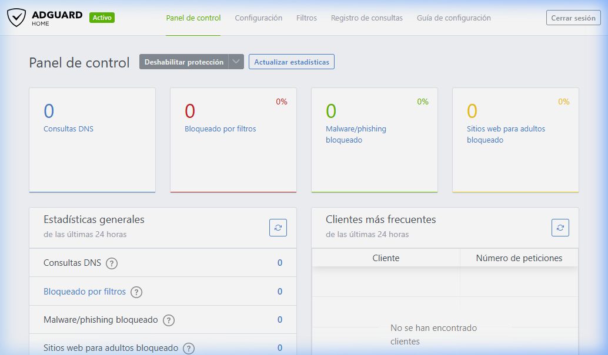
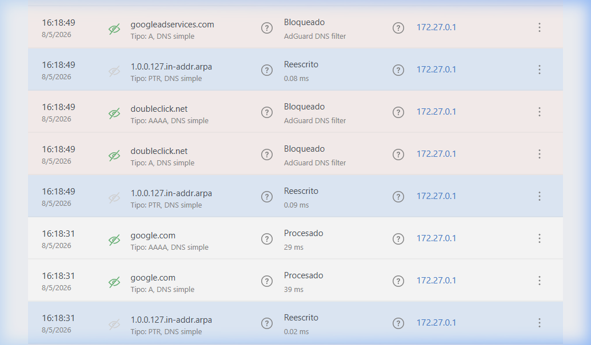
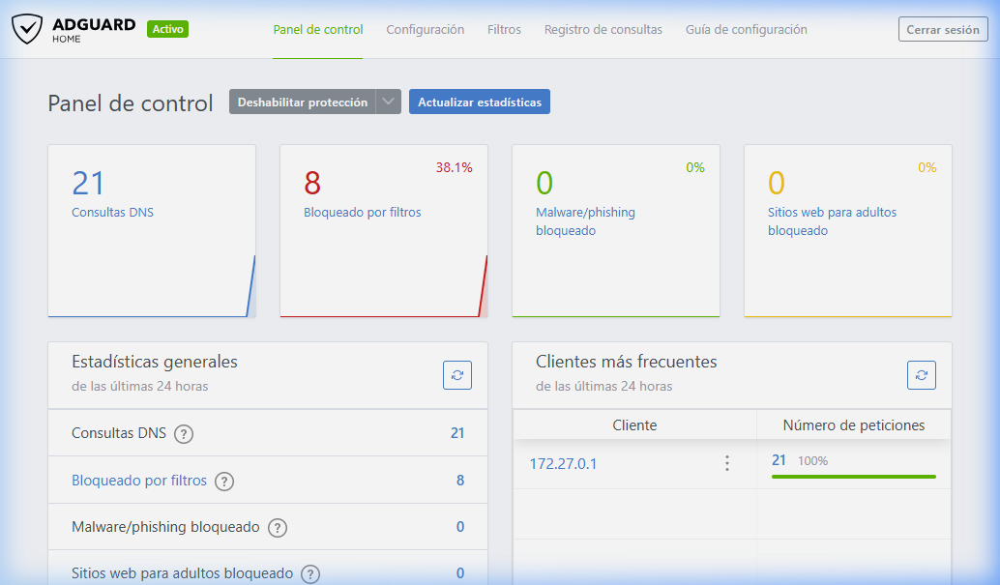

# Pràctica: AdGuard Home amb Docker Compose

Aquest repositori conté la configuració i evidències de la pràctica de desplegament d'AdGuard Home mitjançant Docker Compose.

## Instruccions de Desplegament

Per posar en marxa l'entorn, segueix aquests passos:

1.  **Prerequisits**: Assegura't de tenir instal·lat Docker i Docker Compose.
2.  **Aixecar el servei**: Executa la següent comanda al directori arrel del projecte:
    ```bash
    docker compose up -d
    ```
3.  **Configuració inicial**: Si és la primera vegada que s'executa, accedeix a `http://localhost:3000` per completar l'assistent de configuració.
4.  **Accés al Dashboard**: Un cop configurat, el panel de control estarà disponible a `http://localhost:80`.

## Funcionament de l'Entorn

*   **Servidor DNS**: El contenidor escolta peticions DNS al port 53 (TCP/UDP). Per utilitzar-lo, has de configurar la teva màquina o router per utilitzar la IP del host com a servidor DNS primari.
*   **Persistència**: Totes les dades s'emmagatzemen a les carpetes `workdir` i `confdir`. Això permet que, encara que s'esborri el contenidor, la configuració i les estadístiques es mantinguin en tornar-lo a aixecar.
*   **Administració**: Des del panel de control web, pots afegir noves llistes de bloqueig, veure el registre de consultes en temps real i configurar regles personalitzades.

## 1. Desplegament d'AdGuard Home

S'ha utilitzat un fitxer `docker-compose.yml` per desplegar el servei amb volums persistents per a la configuració i les dades.

### Fitxer `docker-compose.yml`
```yaml
services:
  adguardhome:
    image: adguard/adguardhome
    container_name: adguardhome
    restart: unless-stopped
    volumes:
      - ./workdir:/opt/adguardhome/work
      - ./confdir:/opt/adguardhome/conf
    ports:
      - "53:53/tcp"
      - "53:53/udp"
      - "80:80/tcp"
      - "443:443/tcp"
      - "443:443/udp"
      - "3000:3000/tcp"
      - "853:853/tcp"
      - "784:784/udp"
      - "853:853/udp"
      - "8853:8853/udp"
      - "5443:5443/tcp"
      - "5443:5443/udp"
```

## 2. Configuració com a DNS

S'ha configurat AdGuard Home i s'ha verificat que la màquina local pot resoldre dominis a través d'aquest servidor DNS (IP `127.0.0.1`).



## 3. Llistes de filtratge i bloqueig

S'han activat les llistes de filtratge per defecte (AdGuard DNS filter). S'ha demostrat el bloqueig de dominis publicitaris com `doubleclick.net`.

### Prova de bloqueig via terminal
```bash
nslookup doubleclick.net 127.0.0.1
```
**Resultat:** La consulta retorna `0.0.0.0`, indicant que el domini ha estat bloquejat.

### Registre de consultes (Query Log)


## 4. Estadístiques del Dashboard

Després de realitzar diverses consultes, es poden observar les estadístiques en el panel de control.



---
**Persistent Volumes:** Les carpetes `workdir` i `confdir` al directori arrel del projecte garanteixen que la configuració es mantingui després de reiniciar o eliminar el contenidor.
